# RD Dithering Color Calculator

## Table of Contents

1. [How to Use the Website](#how-to-use-the-website)
2. [How to Use the Templates](#how-to-use-the-templates)
3. [How the Effect Works](#how-the-effect-works)
   1. [The 1bit Filter](#the-1bit-filter)
   2. [Adding Dithering](#adding-dithering)
   3. [Black and White Looks Bad](#black-and-white-looks-bad)
   4. [The Two Templates](#the-two-templates)
4. [Known Limitations and Drawbacks](#known-limitations-and-drawbacks)

## How to Use the Website

1. **Pick your color palette!** You can input any two hex codes you like into the website, or you can find a 1bit palette on [Lospec](https://lospec.com/palette-list/tag/1bit) and load it into the website by pasting a link to it. The website will automatically load in the lightest and darkest color. If you need to, you can switch the light and dark colors at the press of a button -- remember, the lighter color should be on the left, and the darker color on the right.
2. **Pick your template!** Direct your eyes to the readouts below the color pickers. Due to color math stuff, not every color palette can be properly replicated in-game using this technique, so to support as many palettes as possible, there are two different templates that work in slightly different ways. The tl;dr is to pick the template that the website tells you to pick, or to pick the light template if it says both are perfect -- it's easier to work with. Know, however, that unless it says "perfect", there _will_ be a difference between the palette you selected and the palette that's able to be replicated in-game. I'm convinced that until we get room masks this is an unsolvable problem (see [known limitations and drawbacks](#known-limitations-and-drawbacks))
3. **Download your template!** Just click on the template you'd like to download and you'll be prompted to download a zip file. Unzip it to a directory of your choice and open the .rdlevel!

## How to Use the Templates

1. **Load in your palette!** If you look in the purple actions tab, you'll see two different Set Background events in the upper left. For the upper-most Set Background, paste the foreground color given to you by the website (the entire hex code, including the alpha). For the other Set Background, immediately below the first one, paste the background color given to you by the website. Hit play and you should see your palette replicated in-game! If the website said "recommended" and not "perfect", you may notice a discrepency between the palette you selected and what was replicated in-game. It's up to you whether or not it appears "good enough" or if you want to switch palettes.
2. **Explore!** I've left lots of notes, tips, and recommended settings throughout the template, so give them a read!

## How the Effect Works

### Warning: This isn't at all essential info to use the effect, this is just to sate the curiosity of people who want to know how the effect works technically and what the website does to calculate the colors. Nerd shit incoming!

### The 1bit Filter

So, the first thing to consider when making the 1bit effect is figuring out how to boil the screen down to just two colors. I did some experimenting, trying to make something weird happen with contrast and 1% mosaic, but the only solution I found is to use a color mask. A black color mask with a threshold of 173% and 0% feathering will exactly mask out everything except for pure white, giving us a simple filter to turn a normal level into a 1bit image. With some aggressive brightness adjustments, we can get something with a decent amount of black and a decent amount of white.

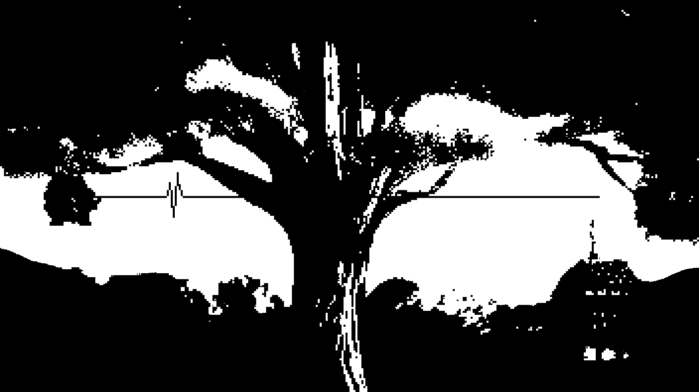

### Adding Dithering

But as it is right now, either something is pure white, and it's opaque in the mask, or it's _anything_ less and it's _always_ transparent, which means everything is a hard line -- and we want a little more nuance than that. What we need is, for every pixel on the screen, it to effectively have a certain _chance_ to be white _depending on how bright it is._

This sounds like it would be Utter Hell to implement, but there's actually a pretty elegant solution. Well, kinda.

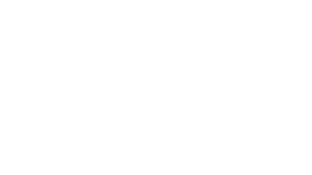

This specific image is the answer to all our problems. This is a dithering pattern. Or more specifically, it's 63 translucent dithering patterns layered on top of each other.

If we layer this on top of our image before we pass it through our 1-bit-ifier, you can see that _magically_ we get some lovely dithering going on. What's happening here?

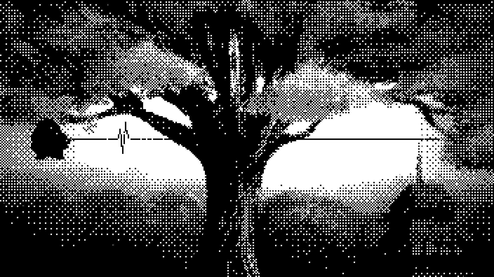

It's doing exactly what we set out to do. The dithering pattern brightens pixels in a pattern across the screen, such that, for a 50% gray area of pixels, for example, 50% of those pixels are then made pure white -- and all the other pixels that fall short get masked out, making them pure black.

So, mission accomplished! 1bit with dithering! Woo! Our next consideration is making it so you can choose your color palette.

### Black and White Looks Bad

Replacing black with a different color is actually pretty trivial. All we have to do is position another room behind the room we've been working with, and then set this new room to have the background color we want.\
_(I'll be using [Pixel Ink](https://lospec.com/palette-list/pixel-ink) by [Polyducks](https://lospec.com/polyducks) for the example images here.)_

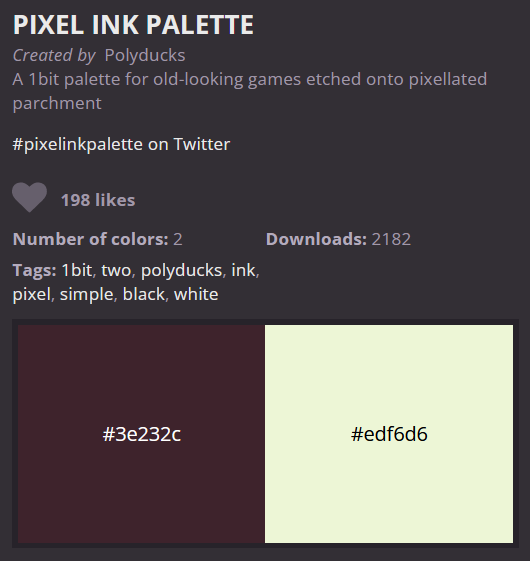

Now, when we hit play again, we can see that our desired dark color appears instead of black, just as we wanted. Now all we have to do is figure out how to control the light color! Can't be that hard.

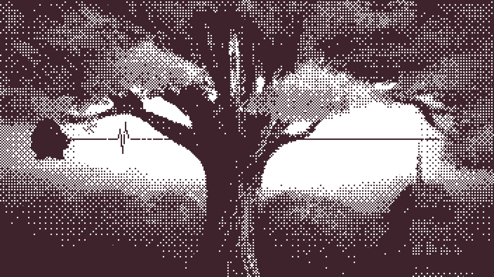

For a while I thought it would be legitimately impossible to control the light color while maintaining true 1bit, but eventually I figured out a solution... it's just not a simple one. The basic idea is that, no matter what our desired light color is, there's _some color_ with _some opacity_ which, when layered over white, creates that desired light color. Think of it like we're using a razor blade to slice through our color, leaving us with a paper white base and a translucent film.

The issue comes, then, in actually finding this color and this opacity. For the levels I made for smol Jam 3, I effectively brute-forced it manually -- trying different colors and opacities until I found one that worked -- but for sharing this technique publicly, I wanted to find a more reliable solution.

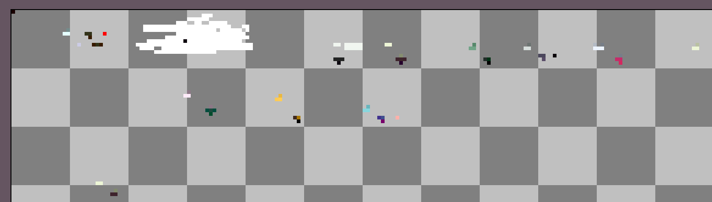
_My aseprite working file from when I was trying to brute force._

Eventually, while searching for color-keying techniques, I stumbled across GIMP's Color to Alpha function, which miraculously does _exactly_ what I need. If you want to read more about how this function works, I'd recommend reading [this Medium article](https://medium.com/@mcreynolds02/how-gimps-color-to-alpha-tool-works-82372367afcd) by Maverick Reynolds, he describes it much better and in much more technical detail than I could. The gist, however, is that this function accepts an input color and a color to turn to alpha, and then returns a color and an alpha value -- it's our razor blade!

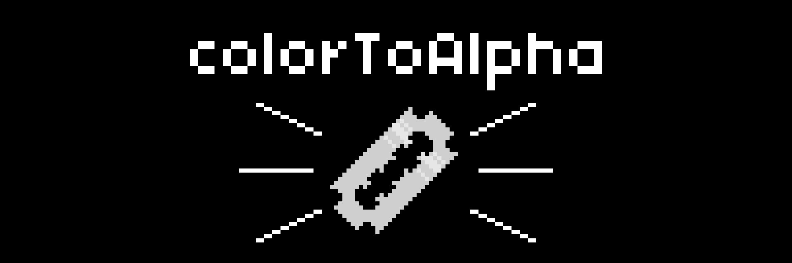

So, with all of that, we now can generate an overlay color (for this palette it's #8fc70029) and use another room to put that overlay over the entire screen, successfully letting us customize our light color however we want and everything is perfect and -- that's not quite right.

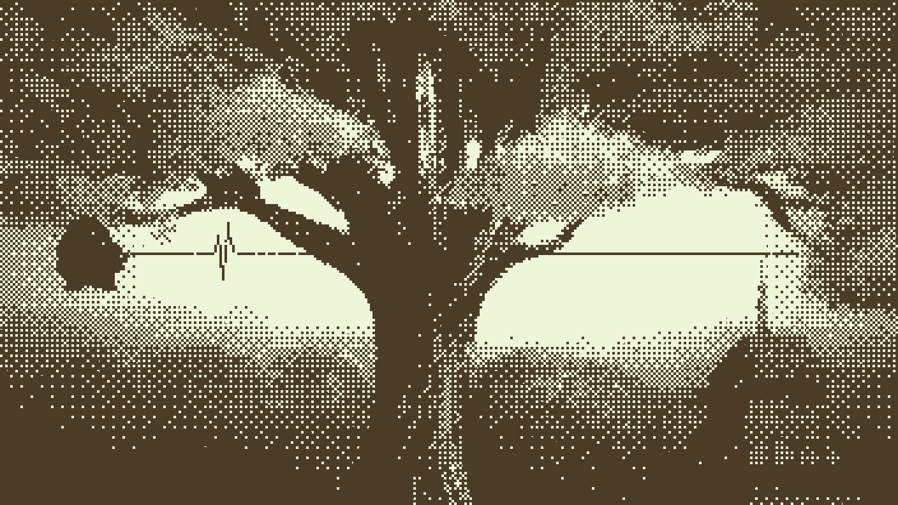

Now that we have an _overlay,_ over the _entire screen,_ we have to now _counteract_ this overlay in order for our bottom color to display properly. Don't you just love color math?

This problem is actually much more straight-forward to solve. If you're familiar with rendering, you're likely familiar with the alpha blending equation:

`(1 - alpha) * opaqueColor + alpha * translucentColor = finalColor`

This is the equation used whenever you have a translucent color layed on top of some opaque color -- it's exactly the same math as what's happening inside Rhythm Doctor -- and if you think about it, we actually know all but one of these components. We know what final color we want -- that's our desired dark color -- and we know the translucent color and alpha from our overlay, so all we have to do is a bit of algebra to solve for the original opaque color:

`opaqueColor = (finalColor - alpha * translucentColor) / (1 - alpha)`

Plugging in our numbers and running the calculations...

`opaqueColor = ((0.24, 0.14, 0.17) - 0.16 * (0.56, 0.79, 0)) / (1 - 0.16)`\
`opaqueColor = ((0.24, 0.14, 0.17) - (0.09, 0.13, 0)) / 0.84`\
`opaqueColor = (0.15, 0.01, 0.17) / 0.84`\
`opaqueColor = (0.18, 0.01, 0.2)`\
_(several decimal places rounded off throughout)_

We get an adjusted background color of #2e0434, which we can then use in Rhythm Doctor and voila!

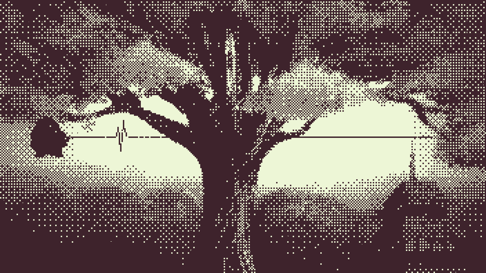

This has all worked, but to ensure our technique is sound, let's go through the whole process again but with a different palette; this time we'll use [Bitbee](https://lospec.com/palette-list/bitbee) by [Poltergasm](https://lospec.com/iampoltergasm).

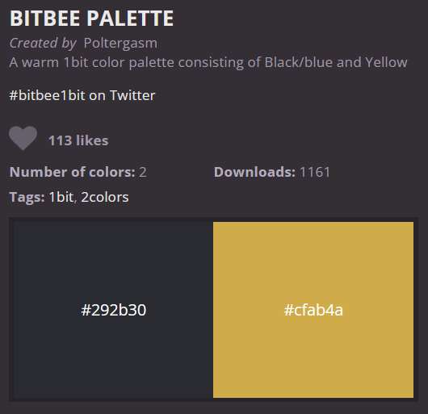

First, we need to use that Color to Alpha function to get our overlay color.

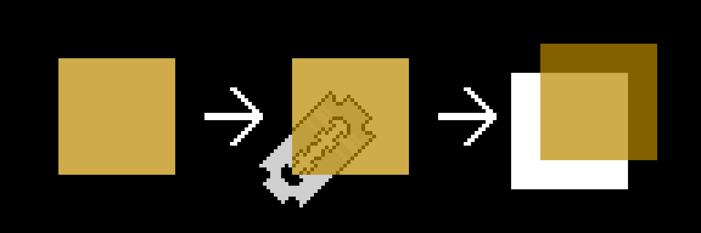

Then, we plug everything into our rearranged alpha blending function...

`opaqueColor = ((0.16, 0.17, 0.19) - 0.71 * (0.73, 0.54, 0)) / (1 - 0.71)`\
`opaqueColor = ((0.16, 0.17, 0.19) - (0.52, 0.38, 0)) / 0.29`\
`opaqueColor = (-0.36, -0.21, 0.19) / 0.29`\
`opaqueColor = (-1.24, -0.72, 0.66)`

Oh dear. There's no mistake in our math here. The only way to properly replicate this palette, with this technique, would be if we could have a color darker than black... which is of course impossible. This is the biggest drawback with this technique, some palettes are just incompatible no matter what we do.

So then, let's change our technique.

### The Two Templates

There's a decision that we made at the very beginning, that you may or may not have caught. We set up our 1bit filter to make everything except pure white transparent... but there's no reason why we couldn't have inverted that, and thus inverted the entire technique. If we instead use a _white_ color mask (with the same 173% threshold), then everything except pure black will be made transparent.

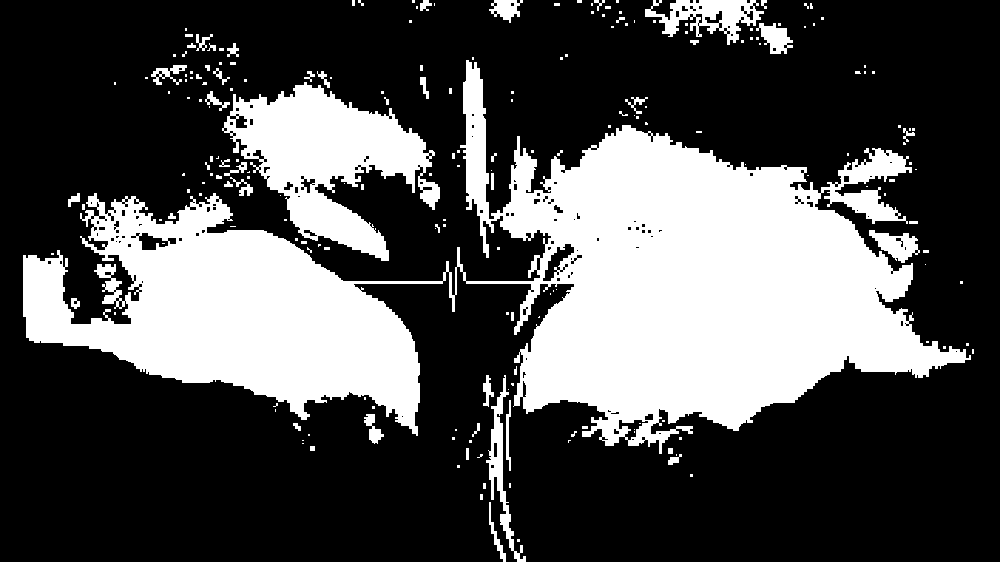

Then, we can invert our dithering overlay, so it now brings pixels closer to true black rather than true white.

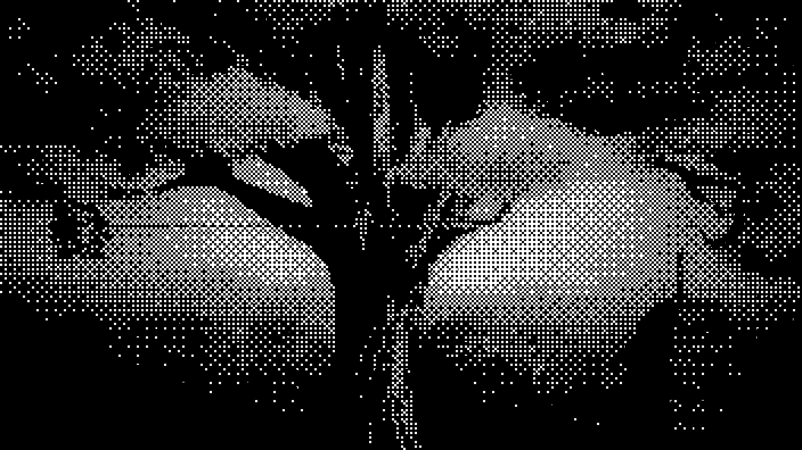

So far this is looking decently similar, but the important changes start happening when we get to the colors. Now, instead of tinting _white_ to become our _light color_, we're tinting _black_ to become our _dark color_.

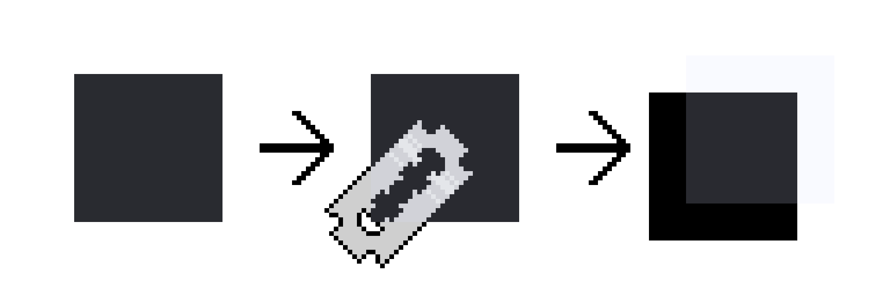

If we take a moment and pause, we can see that this new overlay color we've found has a much lower alpha than the first one we found, meaning it will be easier to work around and counteract.

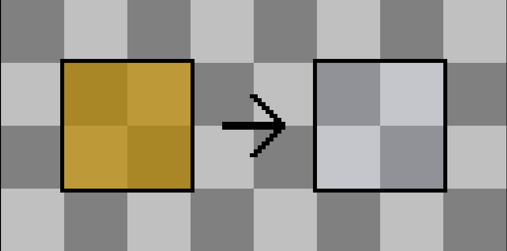

So, when we use it for our rearranged alpha blending function, this time we get a result that's actually a real color.

`opaqueColor = ((0.81, 0.67, 0.29) - 0.19 * (0.85, 0.89, 1)) / (1 - 0.19)`\
`opaqueColor = ((0.81, 0.67, 0.29) - (0.16, 0.17, 0.19)) / 0.81`\
`opaqueColor = (0.65, 0.5, 0.1) / 0.81`\
`opaqueColor = (0.8, 0.62, 0.12)`

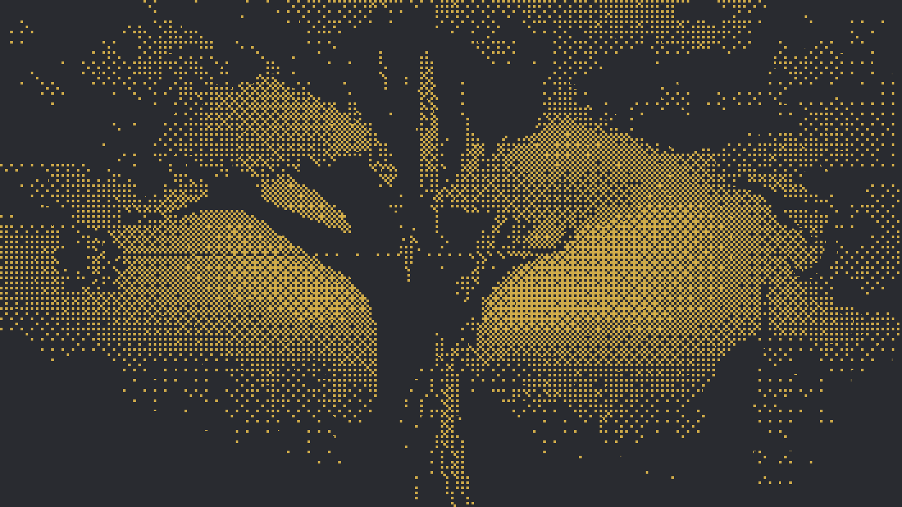

We'll call the first method we found the _light template_ (because it focuses on pure white) and the second method the _dark template_ (because it focuses on pure black)

Even these two templates combined don't ensure compatibility with every palette, however. [Y's Neutral Green](https://lospec.com/palette-list/ys-neutral-green) by [Yelta](https://lospec.com/yelta8), for example, is incompatible with both methods.

Light template:\
`opaqueColor = ((0, 0.3, 0.24) - 0.08 * (1, 0, 0.71)) / (1 - 0.08)`\
`opaqueColor = ((0, 0.3, 0.24) - (0.08, 0, 0.06)) / 0.92`\
`opaqueColor = (-0.08, 0.3, 0.18) / 0.92`\
`opaqueColor = (-0.09, 0.33, 0.2)`

Dark template:\
`opaqueColor = ((1, 0.92, 0.98) - 0.3 * (0, 1, 0.8)) / (1 - 0.3)`\
`opaqueColor = ((1, 0.92, 0.98) - (0, 0.3, 0.24)) / 0.7`\
`opaqueColor = (1, 0.62, 0.74) / 0.7`\
`opaqueColor = (1.43, 0.89, 1.06)` (Values greater than 1 here are also impossible, as they represent a color lighter than white)

I believe this is an unsolvable problem with this technique. Until some other route is found (I'm hopeful that room masks could solve this), the best thing we can do is just to clamp these colors to something possible and calculate which template will give a closer result.

Light template:\
`Clamped value: (0, 0.33, 0.2)`\
`Vector between original and clamped: (0, 0.33, 0.2) - (-0.09, 0.33, 0.2) = (0.09, 0, 0)`\
`Distance between original and clamped: sqrt(0.09^2 + 0^2 + 0^2) = 0.09`

Dark template:\
`Clamped value: (1, 0.89, 1)`\
`Vector between original and clamped: (1, 0.89, 1) - (1.43, 0.89, 1.06) = (-0.43, 0, -0.06)`\
`Distance between original and clamped: sqrt((-0.43)^2 + 0^2 + (-0.06)^2) = 0.43`

Based off of this, it appears we should use the light template, and if we use the clamped colors we can see that, while it's not perfect, it's at least pretty close.

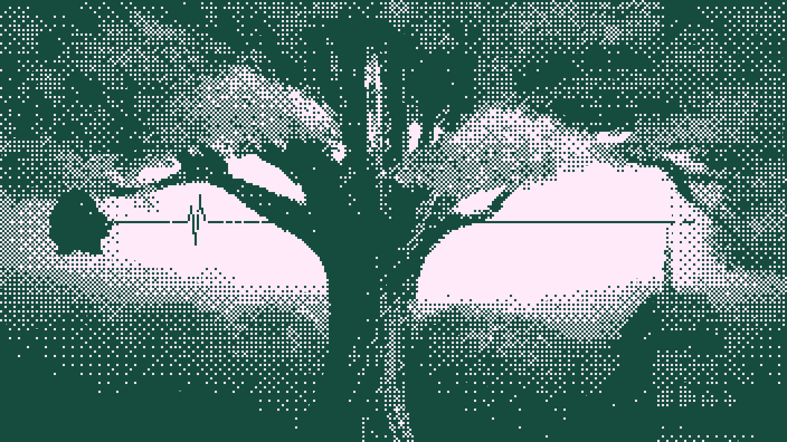

That's the entirety of the technique. A color mask, a dithering pattern, an overlay color, and a background color.

## Known Limitations and Drawbacks

1. Not every palette has perfect compatibility with either template. In particular, the more saturated your palette is and the more disparate your light and dark colors are, the more likely it is to be incompatible. Read [How the Effect Works](#how-the-effect-works) for details on why.
2. This technique makes use of color masks, which are an experimental and not-yet-fully-released feature. It's entirely possible that, when the next update rolls around, every level using this dithering technique will break, and you should be aware of that possibility.
3. Two entire rooms are dedicated to this technique, leaving only two rooms left for you to make your level in. The front-most room can be useful to place things in that you don't want to be affected by the dithering technique, but the back-most room is effectively dead weight unfortunately (maybe you could put a pattern back there?)
4. While the grid of the dithering effect _encourages_ the game to stick to a certain pixel resolution, it doesn't actually enforce it. Particularly at the lower resolutions, if you take a screenshot and zoom in you'll see tons of "pixels" which are the light color for one part and the dark color for the other. If you can think of a way to solve this, let me know!
